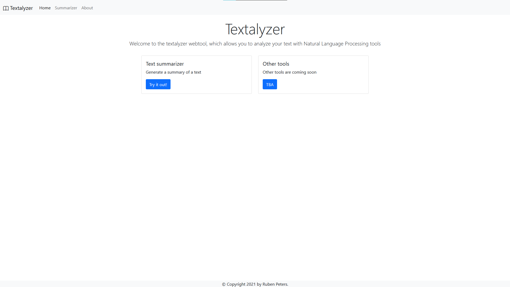

# textalyzer

Simple website for textual analysis, based on Flask, spaCy and Bootstrap.

Currently it has support for keyword extraction and summarization.

To run the app you can either install it yourself using the steps below, or pull the latest
image from DockerHub using: `docker pull rubenpeters91/textalyzer`

## Installation

### Production

Build and run the supplied Dockerfile. It runs the flask website through gunicorn.

### Development

Use `pip install -e .` to install the package.
Also download the required spaCy language model using:

`python -m spacy download en_core_web_sm`

And optionally (for Dutch support):

`python -m spacy download nl_core_news_sm`

It requires Flask, spaCy and numpy to run.

#### Usage

To run the development server use the `run_textalyzer` command.

Alternatively you can set the `FLASK_APP` environment variable to `textalyzer` and run `python -m flask run`.
