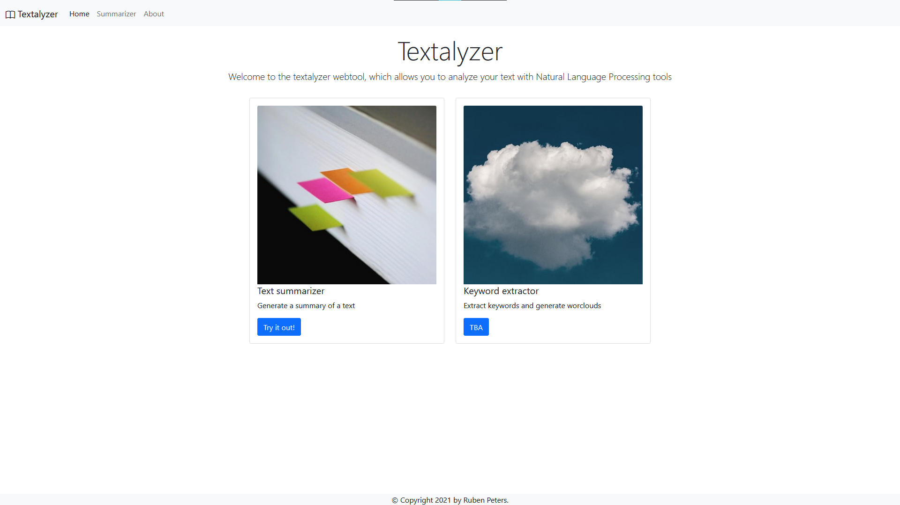

# textalyzer

Simple website for textual analysis, based on Flask, spaCy and Bootstrap

Currently it only supports text summarization, but more will come :)

## Installation

Use `pip install -e .` to install the package.
Also download the required spaCy language model using:
`python -m spacy download en_core_web_sm`

It requires Flask and spaCy to run

## Usage

To run the server use the `run_textalyzer` command

Alternatively you can set the `FLASK_APP` environment variable to `textalyzer` and run `python -m flask run`
